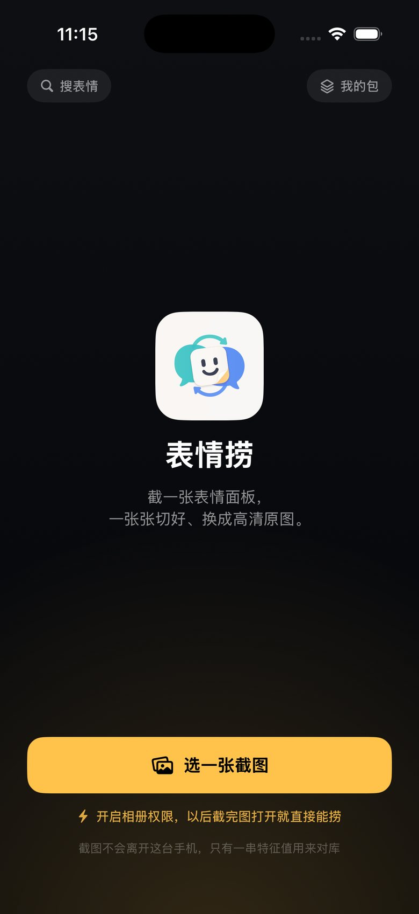

# 表情捞

**截图进来，表情出去。**

 

在群里看到一张想用的表情，现在的做法是截图、裁剪、存相册，再从另一个 App 发出去，而且每转一手画质就差一截。表情捞把这几步压成一步：截一张表情面板，App 认出里面的每一张表情，自动切好，再换成高清原图。

| | |
| --- | --- |
| 角色 | 独立完成产品定义；代码由 AI 编码代理实现，本人负责架构边界和验收 |
| 时间 | 2026.08 至今 |
| 客户端 | iOS 原生 SwiftUI，含分享扩展，约 1 万行 |
| 匹配 | 整条链路在手机上完成。索引 36 MB，一屏 8 张切片 99 毫秒，不联网 |
| 素材 | 32,483 张，116,851 条向量（三尺度 + 动图三帧），全库 30,836 张已人工标注 |
| 状态 | TestFlight 外部测试中 |
| 源码 | 主仓库私有，这里只放产品说明和关键决策 |

这个仓库是项目的公开说明页。隐私政策单独放在 [biaoqinglao-legal](https://github.com/hanselzzh-Wow/biaoqinglao-legal)。

 

## 三个决定

### 1. 把匹配整条搬到手机上

早期版本是端云两级：手机上一份压缩索引，服务端一份全精度索引。线上实测单条查询 3 到 6 秒，而且同一张表情会给出两种不同的结果。

**查下来发现慢的不是算法。** 发 1 条和发 8 条一样慢，时间根本不在计算上；开发机本地直连同一份索引是 20 到 50 毫秒。真正的原因是迁移期两端同时注册，公网流量全部落在了开发机上——手机发出的请求要经 Cloudflare 洛杉矶边缘，穿隧道回到家里的 Mac，再原路返回，跨两次太平洋。机器一睡或者代理一抖就超时，客户端于是退回包内那份更弱的索引（Top-1 只有 80%）。

所以"时灵时不灵"的不是算法，是**答案来自哪一层**。同一条查询连发 14 次，服务端每次给的都一样。

改法是把服务端那 116,851 行压成 PCA-256 加逐维 int8，36 MB 装进 App。判据的 11 维逻辑回归在这份压缩几何上重新训练过——服务端那套系数是在 768 维全精度上拟合的，直接拿来用不对。

| | 服务端全精度 | 端上 |
| --- | --- | --- |
| 操作点（触发里错 ≤2%） | 覆盖 71.5% | 覆盖 71.5%，错 1.7% |
| 一屏 8 张切片 | 3–6 秒，要联网 | **99 毫秒，不联网** |

量化这里有个坑：每一维的尺度不同，直接拿裸 int8 做点积等于把权重扭歪，判据覆盖会掉 6 个点（72.9% → 67.0%）。要把 scale/127 折进查询向量才对。这类数值错误不会让程序崩溃，只会安静地把 A 换成 B，所以建索引时会同时产出一份 60 条真实查询的黄金结果，契约测试要求第一名完全一致、各项分数对齐到 2e-3。

### 2. 把第三方 AI 全部删掉

原本有三条通路会把切片交给外部大模型（疑难仲裁、配文造梗、按意思搜）。删掉的理由是**收益从来没有被量过**：

- 文档里写着"覆盖 58.3% → 78.5%、误换 6.4% → 0.6%"，但仓库里找不到任何对应的评测脚本或数据集，而且对照组用的还是旧操作点
- 文档说只对胶着的那 10~15% 触发，实现里却是所有还没换上高清的命中都送出去
- 服务端日志显示实际用量是 6 次仲裁、2 次改写，还来自同一个 IP

代价倒是实的：切片要离开设备、每张多等 300 到 600 毫秒、服务端被密钥绑在开发机上。而它想救的那一档（同底不同字、视觉上本来就分不开），已经有一个让用户点一下的选择器兜着，覆盖率 +7.5%，不发图，不依赖外部 API。

删掉之后，截图和切片都不再离开手机，隐私说明里那个同意闸门也跟着不需要了。

### 3. 版权靠事后治理，底线一票否决

表情包天然来自用户创作。如果要求每一张都先拿到书面授权，这个产品就不可能启动。所以采用避风港式的事后机制：权利人申诉 **4 小时内初审，24 小时内下架**，处理链路和台账都已经建好。唯一不讨论的底线是涉及未成年人的真人素材和法律明令禁止的内容：发现即撤，不走申诉流程。

## 服务端现在还做什么

匹配搬走之后，服务端只剩三件事：服务旧版本 App、承接标注回传、以及 AI 相关的后台功能。原图由边缘 Worker 直接从 R2 出，只出审批账本发布过的清单；清单里没有的回源，由服务端逐条校验审批——边缘只做加速，不做放宽。撤审之后重新发布，边缘 5 分钟内跟上。

## 一个训完决定不上线的模型

Top-3 有 97%，Top-1 却只有 90%，看起来中间有 7 个点的空间。于是训了一个候选级的重排模型，结果 Top-1 只从 90.1% 升到 90.3%，494 条查询里只多对 1 条。

把中间那 36 条逐条摊开看：它们和视觉第一名的分差中位数只有 0.016，83% 落在 0.03 以内；能单靠 OCR 文字区分出来的只占 22%。重排救回了 12 条，但也弄错了差不多同样多条。

**结论是这些错误落在视觉表示本身分不开的区间里，换一个排序器只是让错误换个位置。** 要改的是表示本身，或者补真实标注，不是排序器。所以这个模型没有接进服务端，也没有给发布链路增加一个没有收益的产物。结论和复现方法留在了实验记录里。

## 边界

- 质量数据以合成退化的测试集为主，可以用来比较改动前后，不能代替真实用户截图的验收
- 全库人工标注在 2026 年 9 月底完成，现在可以按系列名和分类搜索（34 套系列、29 个分类）

---

[Hansel Zhang](https://github.com/hanselzzh-Wow) · [hanselzhang.com](https://www.hanselzhang.com)
